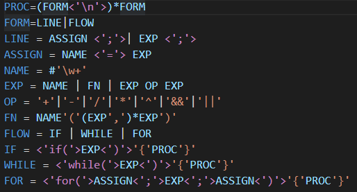

# Instaparse Syntax Highlighter README

Syntax highlighting for Instaparse grammar language: https://github.com/Engelberg/instaparse

Based on https://github.com/mnemnion/instaparse-sublime-highlighting/

Works on source.insta files.

## Release Notes

Users appreciate release notes as you update your extension.

### 1.0.0

Initial release of Instaparse Syntax Highlighting

-----------------------------------------------------------------------------------------------------------

